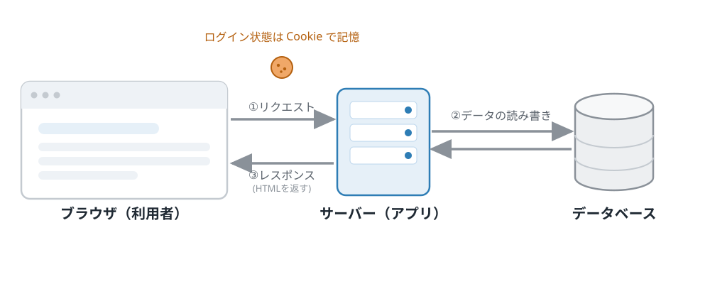
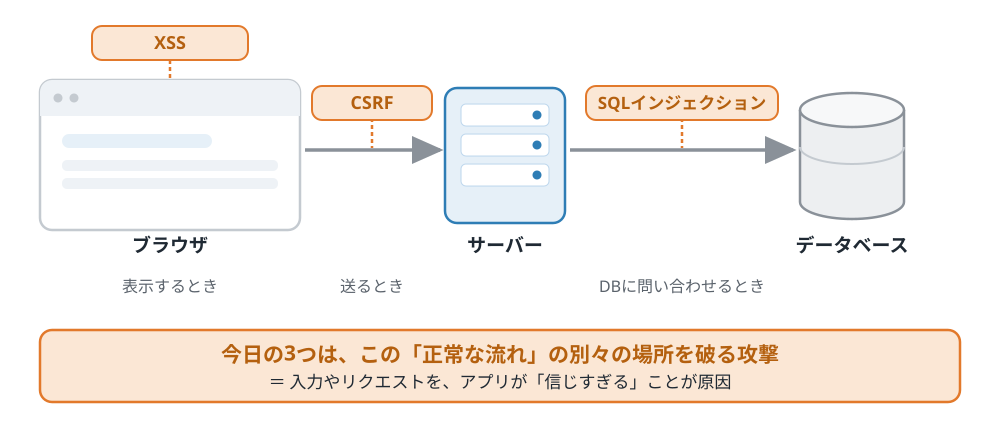
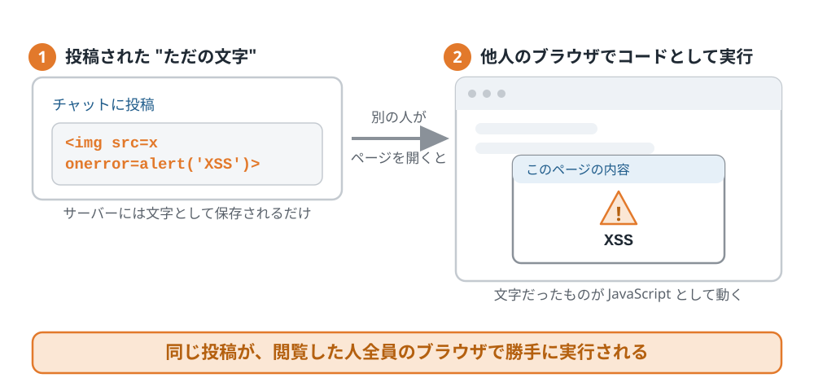
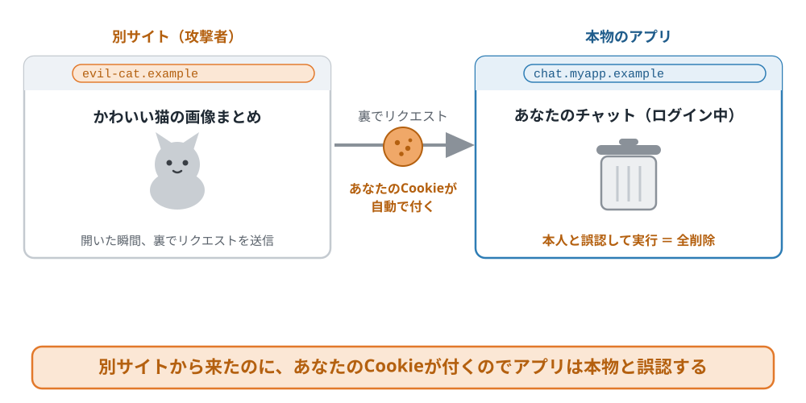
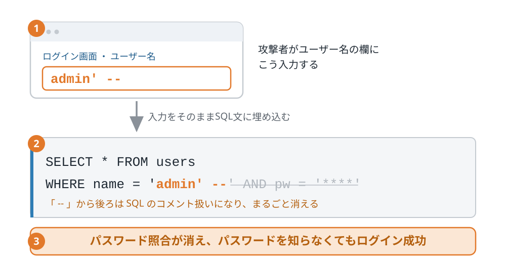

<!-- _class: title -->

Webアプリのセキュリティ入門

SQLインジェクション / XSS / CSRF を、手を動かして体験する

2026/08/17

---

この輪講のゴール

3つの攻撃を 自分の手で成功させ、自分で直して防ぐ。そして 明日から使う視点 を持ち帰る。

1
<b>3つの攻撃を "自分の手" で成功させる</b>「本当に動いてしまう」を体験する

2
<b>自分で直して、攻撃が防げることを確認する</b>なぜ防げるのかを自分の言葉で説明できる

3
<b>明日の PR で使う 3つのチェックポイントを持ち帰る</b>SQL・画面描画・状態変更の見かた（詳細は最後に）

---

目次

1. 導入 ― なぜ他人事じゃないのか 
2. XSS（クロスサイト・スクリプティング） 
3. CSRF（クロスサイト・リクエスト・フォージェリ） 
4. SQLインジェクション 
5. まとめ ― 明日から使うチェックリスト

---

<!-- _class: q -->

1. 導入

その入力・リクエスト、 あなたは <b>信じすぎ</b> ていませんか？

---

1. 導入 ＞ 実際に起きた事件（パソコン遠隔操作事件）

サイトの脆弱性を突いた CSRF攻撃 で、無実の人が次々と誤認逮捕された（2012年）。

- **2012年6〜9月**：何者かが他人のPCを操り、殺害・爆破予告など **13件の犯罪予告** を書き込む
- 著名人を含む **複数の容疑者が逮捕** される
- だが調査で、PCに **マルウェアが仕込まれ遠隔操作** されていたと判明 → **全員が誤認逮捕**
- 真相は **予告サイトの脆弱性を突いた CSRF 攻撃**。真犯人の逮捕は 2013年2月

たった一つの "仕込まれたリクエスト" が、無実の人の人生を変えた。攻撃は入力やリクエストを通じて入ってくる——だから軽視できない。まず "どんな被害になるか" を見てみる。

---

1. 導入 ＞ なぜ自分ごとなのか

Webアプリの穴は なりすまし・改ざん・認証突破 に直結する。今日の3つで、その代表例を自分の手で体験する。

| 代表的な被害 | それを主に起こす攻撃 |
|---|---|
| **なりすまし**（Cookie・セッションを奪われる） | XSS |
| **改ざん・不正操作**（本人として勝手に実行される） | CSRF |
| **認証突破**（パスワードを知らずにログイン） | SQLインジェクション |

特別な道具は要らない。ブラウザに文字を打つだけで起きることもある。今日はそれを自分の手で確かめる。

---

1. 導入 ＞ そもそも Web アプリはどう動く？

Webアプリは ブラウザ・サーバー・データベース のやり取りで動き、ログイン状態は Cookie で覚えている。

---

1. 導入 ＞ 認証（ログイン）はこう動く

ログインに成功すると、サーバーは "合言葉"（セッションID）を Cookie で発行。以降ブラウザは毎回そのCookieを自動で送る。

// ① ログイン成功時：サーバーが "合言葉" を Cookie に載せて返す
res.cookie('session', 合言葉)

// ② 以降のリクエスト：ブラウザが自動で Cookie を付ける
//    → サーバーは Cookie を見て「これは アリス だ」と分かる（＝ログイン状態）

この「自動で付く」性質が、あとで CSRF に悪用される。ここでは「Cookie＝ログイン状態の合言葉」とだけ押さえればOK。

---

1. 導入 ＞ 脆弱性とは

脆弱性とは、この正常な流れのどこかが破られること。原因はどれも入力を信じすぎる／出どころを確認しないのどちらか。

---

1. 導入 ＞ 本日の進め方

自作の脆弱チャットで、攻撃 → 自分で修正 → 再攻撃を自分の手で体験する。

- **① 攻撃する** … 用意したペイロードを貼って、成功を体験
- **② 自分で直す** … コード内の `課題` を検索して1〜2行を修正
- **③ もう一度攻撃する** … さっきの攻撃が失敗することを確認

---

目次

1. 導入 ― なぜ他人事じゃないのか 
2. XSS（クロスサイト・スクリプティング） 
3. CSRF（クロスサイト・リクエスト・フォージェリ） 
4. SQLインジェクション 
5. まとめ ― 明日から使うチェックリスト

---

<!-- _class: q -->

2. XSS

掲示板に投稿した「文字」が、 <b>プログラムとして動く</b>としたら？

---

2. XSS ＞ 仕組み

入力をHTMLとして描画すると、投稿が閲覧者全員のブラウザでスクリプトとして実行される。

---

2. XSS ＞ ハンズオン①

投稿は保存され、このページを開いた人全員のブラウザで発動する。"自分で自分に" ではない。

<b>① 攻撃者役</b> &nbsp; チャットにこのペイロードを投稿（全文は手順書からコピペ）

&lt;img src=x onerror="…偽のウイルス警告ポップアップを出すJS…"&gt;

<b>② 被害者役</b> &nbsp; 別タブで <code>localhost:3000</code> を開く（＝別の訪問者）→ <b>偽のウイルス警告ポップアップが勝手に出る</b>

攻撃者は投稿したらもういない。<b>保存された罠</b>は、そのページを開く人すべてに発動する——これが stored XSS。<b>ブラウザのキャッシュを消しても消えない</b>（サーバーに保存されているから）。戻すにはアドレスバーに <code>localhost:3000/reset</code> と入れる。

---

2. XSS ＞ 対策

入力をHTMLにせず、textContentで「ただの文字」として表示すれば実行されない。

NG：HTMLとして解釈させる

row.innerHTML = m.content;

OK：ただの文字として表示

row.textContent = m.content;

<code>textContent</code> なら <code>&lt;img ...&gt;</code> はタグにならず、そのままの文字として表示される。（Reactが比較的安全なのは、これを既定で自動でやるから）

---

2. XSS ＞ ハンズオン②

自分で直し、同じ投稿が文字列のまま表示されることを確認する。

<b>やってみる</b> &nbsp; <code>public/app.js</code> の <code>【課題2】</code> を <code>textContent</code> に直して保存

- 同じ `` をもう一度投稿 → **アラートは出ず、文字がそのまま表示される**

---

目次

1. 導入 ― なぜ他人事じゃないのか 
2. XSS（クロスサイト・スクリプティング） 
3. CSRF（クロスサイト・リクエスト・フォージェリ） 
4. SQLインジェクション 
5. まとめ ― 明日から使うチェックリスト

---

<!-- _class: q -->

3. CSRF

「猫の画像」を開いただけで、 なぜ自分のデータが<b>消える</b>？

---

3. CSRF ＞ 仕組み

罠ページが裏で削除APIを叩く。そのときログイン中のCookieが自動で付くので、サーバーは本人だと信じて実行する。

<b>Cookieは"盗まれて"いない。</b> 攻撃者は中身を見ておらず、ブラウザが localhost:3000 宛だから勝手に付けているだけ。XSSの「Cookie奪取」とはここが違う。

---

3. CSRF ＞ ハンズオン①

ログイン中に「猫の画像」リンクを踏むと、全メッセージが消える。

<b>やってみる</b> &nbsp; 画面の「知らない人からのDM：猫の画像まとめ」リンクをクリック

- 見た目は猫の画像ページ。なのに開いた瞬間、チャットが**全消去**される
- 現実でも、CSRFは**メール・DM・広告のリンク**を踏ませて始まる

---

3. CSRF ＞ 対策

状態変更をPOSTにし、SameSite Cookie ＋ トークンで出どころを確認する。

NG：GETで状態を変える

app.get(
 '/messages/delete-all', ...)

OK：POST＋出どころ確認

app.post(
 '/messages/delete-all', ...)
// SameSite=Lax ＋ CSRFトークン

POSTにすれば罠のGETナビゲーションでは呼べない。別サイトからのPOSTは <code>SameSite=Lax</code> がCookieを落とすため、未ログイン扱いで弾かれる。

---

3. CSRF ＞ Tips：認証Cookieの付け方

ログイン成功時に発行する Cookie のフラグ が、そのまま XSS・CSRF の防御 になっている。

// ログイン成功時、サーバーがセッションCookieを発行（server.js）
res.cookie('session', id, {
  httpOnly: true,   // JSから読めない       → XSSで盗まれにくい
  sameSite: 'lax',  // 別サイトの送信では付かない → CSRF対策
  secure: true,     // HTTPSでのみ送信
})

たった3つのフラグ。<code>httpOnly</code> がXSS、<code>sameSite</code> がCSRFの効きどころ。付け忘れが事故に直結する。

---

3. CSRF ＞ ハンズオン②

自分で直し、同じ罠リンクを踏んでも何も起きないことを確認する。

<b>やってみる</b> &nbsp; <code>server.js</code> と <code>app.js</code> の <code>【課題3】</code> を POST に直して保存

- もう一度「猫の画像」リンクを踏む → **今度はメッセージが消えない**

---

目次

1. 導入 ― なぜ他人事じゃないのか 
2. XSS（クロスサイト・スクリプティング） 
3. CSRF（クロスサイト・リクエスト・フォージェリ） 
4. SQLインジェクション 
5. まとめ ― 明日から使うチェックリスト

---

<!-- _class: q -->

4. SQLインジェクション

ユーザー名に <code>admin' --</code> と入れると、何が起きる？

---

4. SQLインジェクション ＞ 仕組み① 照合はこう動く

ログインは、入力を文字列連結で作ったSQL文で「ユーザー名とパスワードが両方一致する行」を探しているだけ。

// アプリは "文字列連結" でSQL文を組み立てている（server.js）
const sql = "... WHERE username = '" + username + "' AND password = '" + password + "'"

// 正常  alice / alice123 → username='alice' AND password='alice123'  両方一致 → 成功
// 空欄  admin / (空欄)   → username='admin' AND password=''          照合が残る → 失敗
// 攻撃  admin' --        → 照合の条件ごと "--" で消す（次ページ）      → 誰でも成功

「文字列連結」＝入力を "文字" としてSQL文にそのまま貼り付けること。空欄パスワードは照合が <b>残る</b> ので失敗、注入は照合ごと <b>消す</b> ので成功——ここが決定的に違う。

---

4. SQLインジェクション ＞ 仕組み② admin' -- で照合が消える

入力を文字列連結でSQLに埋め込むと、入力が「命令」として解釈されてしまう。

---

4. SQLインジェクション ＞ ハンズオン①

ユーザー名に <code>admin' --</code> を入れるだけで、パスワードなしで管理者にログインできる。

<b>やってみる</b> &nbsp; ログイン画面のユーザー名にこれを貼る（パスワードは適当）

admin' --

出来上がるSQL: <code>... WHERE username = 'admin' --' AND password = '...'</code> → <code>--</code> 以降がコメント化し、パスワード条件が消える。 <b>補足</b>：同じ穴で <code>' UNION SELECT ...</code> を使えばDBの中身を吸い出す<b>情報漏洩</b>にもつながる。今日は分かりやすい「認証突破」を体験する。

---

4. SQLインジェクション ＞ 対策

プレースホルダを使い、入力を必ず「値」として渡せば防げる。

NG：文字列を連結してSQLを作る

const sql =
 `... WHERE username='${username}'`;
db.prepare(sql).get();

OK：プレースホルダで値を渡す

db.prepare(
 '... WHERE username=? AND pw=?'
).get(username, password);

<code>?</code> なら <code>admin' --</code> は「そういう名前のユーザーを探す」だけになり、文の構造を壊せない。

---

4. SQLインジェクション ＞ ハンズオン②

自分で直し、同じ <code>admin' --</code> が弾かれることを確認する。

<b>やってみる</b> &nbsp; <code>server.js</code> の <code>【課題1】</code> をプレースホルダに直して保存

- もう一度 `admin' --` でログイン → **今度は「違います」で弾かれる**
- `alice` / `alice123` では今まで通りログインできることも確認

---

目次

1. 導入 ― なぜ他人事じゃないのか 
2. XSS（クロスサイト・スクリプティング） 
3. CSRF（クロスサイト・リクエスト・フォージェリ） 
4. SQLインジェクション 
5. まとめ ― 明日から使うチェックリスト

---

5. まとめ ＞ 明日から使うチェックリスト

持ち帰るのは「入力を信じない」と「出どころを確認する」の2つだけ。

| 攻撃 | 見るところ | まずい書き方 | こう直す |
|---|---|---|---|
| **XSS** | 画面表示 | `innerHTML` | **`textContent`** |
| **CSRF** | 状態変更 | `GET` で変更 | **`POST` ＋ SameSite ＋ トークン** |
| **SQLi** | SQL | 文字列連結 | **プレースホルダ `?`** |

---

最後に

ここで学んだ攻撃は、自分が権限を持つ環境でのみ試すこと。

- 他人のサイトやサービスで試すと、**不正アクセス禁止法などに触れる犯罪**です
- 守る側の武器として使ってください

---

<!-- _class: lead -->

おわり

質問タイム

